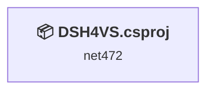
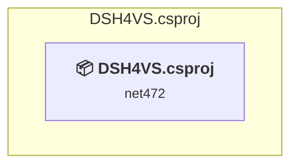

# Projects and dependencies analysis

This document provides a comprehensive overview of the projects and their dependencies in the context of upgrading to .NETCoreApp,Version=v10.0.

## Table of Contents

- [Executive Summary](#executive-Summary)
  - [Highlevel Metrics](#highlevel-metrics)
  - [Projects Compatibility](#projects-compatibility)
  - [Package Compatibility](#package-compatibility)
  - [API Compatibility](#api-compatibility)
  - [Binding Redirect Configuration](#binding-redirect-configuration)
- [Aggregate NuGet packages details](#aggregate-nuget-packages-details)
- [Top API Migration Challenges](#top-api-migration-challenges)
  - [Technologies and Features](#technologies-and-features)
  - [Most Frequent API Issues](#most-frequent-api-issues)
- [Projects Relationship Graph](#projects-relationship-graph)
- [Project Details](#project-details)

  - [src\DSH4VS\DSH4VS.csproj](#srcdsh4vsdsh4vscsproj)

## Executive Summary

### Highlevel Metrics

| Metric | Count | Status |
| :--- | :---: | :--- |
| Total Projects | 1 | All require upgrade |
| Total NuGet Packages | 134 | 4 need upgrade |
| Total Code Files | 13 |  |
| Total Code Files with Incidents | 10 |  |
| Total Lines of Code | 1291 |  |
| Total Number of Issues | 63 |  |
| Estimated LOC to modify | 57+ | at least 4.4% of codebase |

### Projects Compatibility

| Project | Target Framework | Difficulty | Package Issues | API Issues | Binding Issues | Est. LOC Impact | Description |
| :--- | :---: | :---: | :---: | :---: | :---: | :---: | :--- |
| [src\DSH4VS\DSH4VS.csproj](#srcdsh4vsdsh4vscsproj) | net472 | 🟡 Medium | 5 | 57 | 0 | 57+ | Wpf, Sdk Style = True |

### Package Compatibility

| Status | Count | Percentage |
| :--- | :---: | :---: |
| ✅ Compatible | 130 | 97.0% |
| ⚠️ Incompatible | 4 | 3.0% |
| 🔄 Upgrade Recommended | 0 | 0.0% |
| ***Total NuGet Packages*** | ***134*** | ***100%*** |

### API Compatibility

| Category | Count | Impact |
| :--- | :---: | :--- |
| 🔴 Binary Incompatible | 48 | High - Require code changes |
| 🟡 Source Incompatible | 2 | Medium - Needs re-compilation and potential conflicting API error fixing |
| 🔵 Behavioral change | 7 | Low - Behavioral changes that may require testing at runtime |
| ✅ Compatible | 1979 |  |
| ***Total APIs Analyzed*** | ***2036*** |  |

## Aggregate NuGet packages details

| Package | Current Version | Suggested Version | Projects | Description |
| :--- | :---: | :---: | :--- | :--- |
| CommunityToolkit.Mvvm | 8.4.0 |  | [DSH4VS.csproj](#srcdsh4vsdsh4vscsproj) | ✅Compatible |
| envdte | 17.14.40260 |  | [DSH4VS.csproj](#srcdsh4vsdsh4vscsproj) | ✅Compatible |
| envdte100 | 17.14.40260 |  | [DSH4VS.csproj](#srcdsh4vsdsh4vscsproj) | ✅Compatible |
| envdte80 | 17.14.40260 |  | [DSH4VS.csproj](#srcdsh4vsdsh4vscsproj) | ✅Compatible |
| envdte90 | 17.14.40260 |  | [DSH4VS.csproj](#srcdsh4vsdsh4vscsproj) | ✅Compatible |
| envdte90a | 17.14.40260 |  | [DSH4VS.csproj](#srcdsh4vsdsh4vscsproj) | ✅Compatible |
| HandyControl | 3.5.1 |  | [DSH4VS.csproj](#srcdsh4vsdsh4vscsproj) | ✅Compatible |
| MahApps.Metro.IconPacks.Core | 5.0.0 |  | [DSH4VS.csproj](#srcdsh4vsdsh4vscsproj) | ✅Compatible |
| MahApps.Metro.IconPacks.Material | 5.0.0 | 4.11.0 | [DSH4VS.csproj](#srcdsh4vsdsh4vscsproj) | ⚠️NuGet 包不兼容 |
| MessagePack | 2.5.192 |  | [DSH4VS.csproj](#srcdsh4vsdsh4vscsproj) | ✅Compatible |
| MessagePack.Annotations | 2.5.192 |  | [DSH4VS.csproj](#srcdsh4vsdsh4vscsproj) | ✅Compatible |
| Microsoft.Bcl.AsyncInterfaces | 9.0.0 |  | [DSH4VS.csproj](#srcdsh4vsdsh4vscsproj) | ✅Compatible |
| Microsoft.Build.Framework | 17.14.7 |  | [DSH4VS.csproj](#srcdsh4vsdsh4vscsproj) | ✅Compatible |
| Microsoft.CSharp | 4.7.0 |  | [DSH4VS.csproj](#srcdsh4vsdsh4vscsproj) | ✅Compatible |
| Microsoft.IO.Redist | 6.1.0 |  | [DSH4VS.csproj](#srcdsh4vsdsh4vscsproj) | ✅Compatible |
| Microsoft.NET.StringTools | 17.14.7 |  | [DSH4VS.csproj](#srcdsh4vsdsh4vscsproj) | ✅Compatible |
| Microsoft.NETCore.Platforms | 1.1.1 |  | [DSH4VS.csproj](#srcdsh4vsdsh4vscsproj) | ✅Compatible |
| Microsoft.NETCore.Targets | 1.1.3 |  | [DSH4VS.csproj](#srcdsh4vsdsh4vscsproj) | ✅Compatible |
| Microsoft.NETFramework.ReferenceAssemblies | 1.0.3 |  | [DSH4VS.csproj](#srcdsh4vsdsh4vscsproj) | ⚠️NuGet 包不兼容 |
| Microsoft.NETFramework.ReferenceAssemblies.net472 | 1.0.3 |  | [DSH4VS.csproj](#srcdsh4vsdsh4vscsproj) | ✅Compatible |
| Microsoft.ServiceHub.Analyzers | 4.8.55 |  | [DSH4VS.csproj](#srcdsh4vsdsh4vscsproj) | ✅Compatible |
| Microsoft.ServiceHub.Framework | 4.8.55 |  | [DSH4VS.csproj](#srcdsh4vsdsh4vscsproj) | ✅Compatible |
| Microsoft.ServiceHub.Resources | 4.6.2052 |  | [DSH4VS.csproj](#srcdsh4vsdsh4vscsproj) | ✅Compatible |
| Microsoft.VisualStudio.CommandBars | 17.14.40260 |  | [DSH4VS.csproj](#srcdsh4vsdsh4vscsproj) | ✅Compatible |
| Microsoft.VisualStudio.ComponentModelHost | 17.14.106 |  | [DSH4VS.csproj](#srcdsh4vsdsh4vscsproj) | ✅Compatible |
| Microsoft.VisualStudio.Composition | 17.13.41 |  | [DSH4VS.csproj](#srcdsh4vsdsh4vscsproj) | ✅Compatible |
| Microsoft.VisualStudio.Composition.Analyzers | 17.13.41 |  | [DSH4VS.csproj](#srcdsh4vsdsh4vscsproj) | ✅Compatible |
| Microsoft.VisualStudio.CoreUtility | 17.14.249 |  | [DSH4VS.csproj](#srcdsh4vsdsh4vscsproj) | ✅Compatible |
| Microsoft.VisualStudio.Debugger.Interop.10.0 | 17.14.40260 |  | [DSH4VS.csproj](#srcdsh4vsdsh4vscsproj) | ✅Compatible |
| Microsoft.VisualStudio.Debugger.Interop.12.0 | 17.14.40260 |  | [DSH4VS.csproj](#srcdsh4vsdsh4vscsproj) | ✅Compatible |
| Microsoft.VisualStudio.Debugger.Interop.14.0 | 17.14.40260 |  | [DSH4VS.csproj](#srcdsh4vsdsh4vscsproj) | ✅Compatible |
| Microsoft.VisualStudio.Debugger.Interop.15.0 | 17.14.40260 |  | [DSH4VS.csproj](#srcdsh4vsdsh4vscsproj) | ✅Compatible |
| Microsoft.VisualStudio.Debugger.Interop.16.0 | 17.14.40260 |  | [DSH4VS.csproj](#srcdsh4vsdsh4vscsproj) | ✅Compatible |
| Microsoft.VisualStudio.Debugger.InteropA | 17.14.40260 |  | [DSH4VS.csproj](#srcdsh4vsdsh4vscsproj) | ✅Compatible |
| Microsoft.VisualStudio.Designer.Interfaces | 17.14.40260 |  | [DSH4VS.csproj](#srcdsh4vsdsh4vscsproj) | ✅Compatible |
| Microsoft.VisualStudio.Editor | 17.14.249 |  | [DSH4VS.csproj](#srcdsh4vsdsh4vscsproj) | ✅Compatible |
| Microsoft.VisualStudio.Extensibility.Editor.Contracts | 17.14.249 |  | [DSH4VS.csproj](#srcdsh4vsdsh4vscsproj) | ✅Compatible |
| Microsoft.VisualStudio.GraphModel | 17.14.40260 |  | [DSH4VS.csproj](#srcdsh4vsdsh4vscsproj) | ✅Compatible |
| Microsoft.VisualStudio.ImageCatalog | 17.14.40260 |  | [DSH4VS.csproj](#srcdsh4vsdsh4vscsproj) | ✅Compatible |
| Microsoft.VisualStudio.Imaging | 17.14.40264 |  | [DSH4VS.csproj](#srcdsh4vsdsh4vscsproj) | ✅Compatible |
| Microsoft.VisualStudio.Imaging.Interop.14.0.DesignTime | 17.14.40254 |  | [DSH4VS.csproj](#srcdsh4vsdsh4vscsproj) | ✅Compatible |
| Microsoft.VisualStudio.Interop | 17.14.40260 |  | [DSH4VS.csproj](#srcdsh4vsdsh4vscsproj) | ✅Compatible |
| Microsoft.VisualStudio.Language | 17.14.249 |  | [DSH4VS.csproj](#srcdsh4vsdsh4vscsproj) | ✅Compatible |
| Microsoft.VisualStudio.Language.Intellisense | 17.14.249 |  | [DSH4VS.csproj](#srcdsh4vsdsh4vscsproj) | ✅Compatible |
| Microsoft.VisualStudio.Language.NavigateTo.Interfaces | 17.14.249 |  | [DSH4VS.csproj](#srcdsh4vsdsh4vscsproj) | ✅Compatible |
| Microsoft.VisualStudio.Language.StandardClassification | 17.14.249 |  | [DSH4VS.csproj](#srcdsh4vsdsh4vscsproj) | ✅Compatible |
| Microsoft.VisualStudio.LanguageServer.Client | 17.14.60 |  | [DSH4VS.csproj](#srcdsh4vsdsh4vscsproj) | ✅Compatible |
| Microsoft.VisualStudio.Linux.ConnectionManager.Store | 17.14.40254 |  | [DSH4VS.csproj](#srcdsh4vsdsh4vscsproj) | ✅Compatible |
| Microsoft.VisualStudio.OLE.Interop | 17.14.40260 |  | [DSH4VS.csproj](#srcdsh4vsdsh4vscsproj) | ✅Compatible |
| Microsoft.VisualStudio.Package.LanguageService.15.0 | 17.14.40264 |  | [DSH4VS.csproj](#srcdsh4vsdsh4vscsproj) | ✅Compatible |
| Microsoft.VisualStudio.ProjectAggregator | 17.14.40254 |  | [DSH4VS.csproj](#srcdsh4vsdsh4vscsproj) | ✅Compatible |
| Microsoft.VisualStudio.RemoteControl | 16.3.52 |  | [DSH4VS.csproj](#srcdsh4vsdsh4vscsproj) | ✅Compatible |
| Microsoft.VisualStudio.RpcContracts | 17.14.20 |  | [DSH4VS.csproj](#srcdsh4vsdsh4vscsproj) | ✅Compatible |
| Microsoft.VisualStudio.SDK | 17.14.40265 | 16.0.208 | [DSH4VS.csproj](#srcdsh4vsdsh4vscsproj) | ⚠️NuGet 包不兼容 |
| Microsoft.VisualStudio.SDK.Analyzers | 17.7.79 |  | [DSH4VS.csproj](#srcdsh4vsdsh4vscsproj) | ✅Compatible |
| Microsoft.VisualStudio.Setup.Configuration.Interop | 3.14.2075 |  | [DSH4VS.csproj](#srcdsh4vsdsh4vscsproj) | ✅Compatible |
| Microsoft.VisualStudio.Shell.15.0 | 17.14.40264 |  | [DSH4VS.csproj](#srcdsh4vsdsh4vscsproj) | ✅Compatible |
| Microsoft.VisualStudio.Shell.Design | 17.14.40264 |  | [DSH4VS.csproj](#srcdsh4vsdsh4vscsproj) | ✅Compatible |
| Microsoft.VisualStudio.Shell.Framework | 17.14.40264 |  | [DSH4VS.csproj](#srcdsh4vsdsh4vscsproj) | ✅Compatible |
| Microsoft.VisualStudio.Shell.Interop | 17.14.40260 |  | [DSH4VS.csproj](#srcdsh4vsdsh4vscsproj) | ✅Compatible |
| Microsoft.VisualStudio.Shell.Interop.10.0 | 17.14.40260 |  | [DSH4VS.csproj](#srcdsh4vsdsh4vscsproj) | ✅Compatible |
| Microsoft.VisualStudio.Shell.Interop.11.0 | 17.14.40260 |  | [DSH4VS.csproj](#srcdsh4vsdsh4vscsproj) | ✅Compatible |
| Microsoft.VisualStudio.Shell.Interop.12.0 | 17.14.40260 |  | [DSH4VS.csproj](#srcdsh4vsdsh4vscsproj) | ✅Compatible |
| Microsoft.VisualStudio.Shell.Interop.8.0 | 17.14.40260 |  | [DSH4VS.csproj](#srcdsh4vsdsh4vscsproj) | ✅Compatible |
| Microsoft.VisualStudio.Shell.Interop.9.0 | 17.14.40260 |  | [DSH4VS.csproj](#srcdsh4vsdsh4vscsproj) | ✅Compatible |
| Microsoft.VisualStudio.TaskRunnerExplorer.14.0 | 14.0.0 |  | [DSH4VS.csproj](#srcdsh4vsdsh4vscsproj) | ✅Compatible |
| Microsoft.VisualStudio.Telemetry | 17.14.18 |  | [DSH4VS.csproj](#srcdsh4vsdsh4vscsproj) | ✅Compatible |
| Microsoft.VisualStudio.Text.Data | 17.14.249 |  | [DSH4VS.csproj](#srcdsh4vsdsh4vscsproj) | ✅Compatible |
| Microsoft.VisualStudio.Text.Logic | 17.14.249 |  | [DSH4VS.csproj](#srcdsh4vsdsh4vscsproj) | ✅Compatible |
| Microsoft.VisualStudio.Text.UI | 17.14.249 |  | [DSH4VS.csproj](#srcdsh4vsdsh4vscsproj) | ✅Compatible |
| Microsoft.VisualStudio.Text.UI.Wpf | 17.14.249 |  | [DSH4VS.csproj](#srcdsh4vsdsh4vscsproj) | ✅Compatible |
| Microsoft.VisualStudio.TextManager.Interop | 17.14.40260 |  | [DSH4VS.csproj](#srcdsh4vsdsh4vscsproj) | ✅Compatible |
| Microsoft.VisualStudio.TextManager.Interop.10.0 | 17.14.40260 |  | [DSH4VS.csproj](#srcdsh4vsdsh4vscsproj) | ✅Compatible |
| Microsoft.VisualStudio.TextManager.Interop.11.0 | 17.14.40260 |  | [DSH4VS.csproj](#srcdsh4vsdsh4vscsproj) | ✅Compatible |
| Microsoft.VisualStudio.TextManager.Interop.12.0 | 17.14.40260 |  | [DSH4VS.csproj](#srcdsh4vsdsh4vscsproj) | ✅Compatible |
| Microsoft.VisualStudio.TextManager.Interop.8.0 | 17.14.40260 |  | [DSH4VS.csproj](#srcdsh4vsdsh4vscsproj) | ✅Compatible |
| Microsoft.VisualStudio.TextManager.Interop.9.0 | 17.14.40260 |  | [DSH4VS.csproj](#srcdsh4vsdsh4vscsproj) | ✅Compatible |
| Microsoft.VisualStudio.TextTemplating.VSHost | 17.14.40265 |  | [DSH4VS.csproj](#srcdsh4vsdsh4vscsproj) | ✅Compatible |
| Microsoft.VisualStudio.Threading | 17.14.15 |  | [DSH4VS.csproj](#srcdsh4vsdsh4vscsproj) | ✅Compatible |
| Microsoft.VisualStudio.Threading.Analyzers | 17.14.15 |  | [DSH4VS.csproj](#srcdsh4vsdsh4vscsproj) | ✅Compatible |
| Microsoft.VisualStudio.Threading.Only | 17.14.15 |  | [DSH4VS.csproj](#srcdsh4vsdsh4vscsproj) | ✅Compatible |
| Microsoft.VisualStudio.Utilities | 17.14.40264 |  | [DSH4VS.csproj](#srcdsh4vsdsh4vscsproj) | ✅Compatible |
| Microsoft.VisualStudio.Utilities.Internal | 16.3.90 |  | [DSH4VS.csproj](#srcdsh4vsdsh4vscsproj) | ✅Compatible |
| Microsoft.VisualStudio.Validation | 17.8.8 |  | [DSH4VS.csproj](#srcdsh4vsdsh4vscsproj) | ✅Compatible |
| Microsoft.VisualStudio.VCProjectEngine | 17.14.40264 |  | [DSH4VS.csproj](#srcdsh4vsdsh4vscsproj) | ✅Compatible |
| Microsoft.VisualStudio.VSHelp | 17.14.40260 |  | [DSH4VS.csproj](#srcdsh4vsdsh4vscsproj) | ✅Compatible |
| Microsoft.VisualStudio.VSHelp80 | 17.14.40260 |  | [DSH4VS.csproj](#srcdsh4vsdsh4vscsproj) | ✅Compatible |
| Microsoft.VisualStudio.WCFReference.Interop | 17.14.40260 |  | [DSH4VS.csproj](#srcdsh4vsdsh4vscsproj) | ✅Compatible |
| Microsoft.VisualStudio.Web.BrowserLink.12.0 | 12.0.0 |  | [DSH4VS.csproj](#srcdsh4vsdsh4vscsproj) | ✅Compatible |
| Microsoft.VSSDK.BuildTools | 17.14.2142 | 15.7.104 | [DSH4VS.csproj](#srcdsh4vsdsh4vscsproj) | ⚠️NuGet 包不兼容 |
| Microsoft.VsSDK.CompatibilityAnalyzer | 17.14.2142 |  | [DSH4VS.csproj](#srcdsh4vsdsh4vscsproj) | ✅Compatible |
| Microsoft.Web.WebView2 | 1.0.4129.50 |  | [DSH4VS.csproj](#srcdsh4vsdsh4vscsproj) | ✅Compatible |
| Microsoft.Win32.Registry | 5.0.0 |  | [DSH4VS.csproj](#srcdsh4vsdsh4vscsproj) | ✅Compatible |
| Nerdbank.Streams | 2.12.87 |  | [DSH4VS.csproj](#srcdsh4vsdsh4vscsproj) | ✅Compatible |
| NETStandard.Library | 2.0.3 |  | [DSH4VS.csproj](#srcdsh4vsdsh4vscsproj) | 框架引用中包含 NuGet 包功能 |
| Newtonsoft.Json | 13.0.3 |  | [DSH4VS.csproj](#srcdsh4vsdsh4vscsproj) | ✅Compatible |
| stdole | 17.14.40260 |  | [DSH4VS.csproj](#srcdsh4vsdsh4vscsproj) | ✅Compatible |
| StreamJsonRpc | 2.22.11 |  | [DSH4VS.csproj](#srcdsh4vsdsh4vscsproj) | ✅Compatible |
| System.Buffers | 4.6.0 |  | [DSH4VS.csproj](#srcdsh4vsdsh4vscsproj) | ✅Compatible |
| System.Collections.Immutable | 9.0.0 |  | [DSH4VS.csproj](#srcdsh4vsdsh4vscsproj) | ✅Compatible |
| System.ComponentModel.Annotations | 5.0.0 |  | [DSH4VS.csproj](#srcdsh4vsdsh4vscsproj) | ✅Compatible |
| System.ComponentModel.Composition | 9.0.0 |  | [DSH4VS.csproj](#srcdsh4vsdsh4vscsproj) | ✅Compatible |
| System.Composition | 9.0.0 |  | [DSH4VS.csproj](#srcdsh4vsdsh4vscsproj) | ✅Compatible |
| System.Composition.AttributedModel | 9.0.0 |  | [DSH4VS.csproj](#srcdsh4vsdsh4vscsproj) | ✅Compatible |
| System.Composition.Convention | 9.0.0 |  | [DSH4VS.csproj](#srcdsh4vsdsh4vscsproj) | ✅Compatible |
| System.Composition.Hosting | 9.0.0 |  | [DSH4VS.csproj](#srcdsh4vsdsh4vscsproj) | ✅Compatible |
| System.Composition.Runtime | 9.0.0 |  | [DSH4VS.csproj](#srcdsh4vsdsh4vscsproj) | ✅Compatible |
| System.Composition.TypedParts | 9.0.0 |  | [DSH4VS.csproj](#srcdsh4vsdsh4vscsproj) | ✅Compatible |
| System.Diagnostics.DiagnosticSource | 9.0.0 |  | [DSH4VS.csproj](#srcdsh4vsdsh4vscsproj) | ✅Compatible |
| System.IO.Pipelines | 9.0.0 |  | [DSH4VS.csproj](#srcdsh4vsdsh4vscsproj) | ✅Compatible |
| System.Memory | 4.6.0 |  | [DSH4VS.csproj](#srcdsh4vsdsh4vscsproj) | ✅Compatible |
| System.Numerics.Vectors | 4.6.0 |  | [DSH4VS.csproj](#srcdsh4vsdsh4vscsproj) | ✅Compatible |
| System.Private.Uri | 4.3.2 |  | [DSH4VS.csproj](#srcdsh4vsdsh4vscsproj) | ✅Compatible |
| System.Reflection.Metadata | 9.0.0 |  | [DSH4VS.csproj](#srcdsh4vsdsh4vscsproj) | ✅Compatible |
| System.Runtime.CompilerServices.Unsafe | 6.1.0 |  | [DSH4VS.csproj](#srcdsh4vsdsh4vscsproj) | ✅Compatible |
| System.Security.AccessControl | 6.0.0 |  | [DSH4VS.csproj](#srcdsh4vsdsh4vscsproj) | ✅Compatible |
| System.Security.Principal.Windows | 5.0.0 |  | [DSH4VS.csproj](#srcdsh4vsdsh4vscsproj) | ✅Compatible |
| System.Text.Encodings.Web | 9.0.0 |  | [DSH4VS.csproj](#srcdsh4vsdsh4vscsproj) | ✅Compatible |
| System.Text.Json | 9.0.0 |  | [DSH4VS.csproj](#srcdsh4vsdsh4vscsproj) | ✅Compatible |
| System.Threading.AccessControl | 9.0.0 |  | [DSH4VS.csproj](#srcdsh4vsdsh4vscsproj) | ✅Compatible |
| System.Threading.Tasks.Dataflow | 9.0.0 |  | [DSH4VS.csproj](#srcdsh4vsdsh4vscsproj) | ✅Compatible |
| System.Threading.Tasks.Extensions | 4.6.0 |  | [DSH4VS.csproj](#srcdsh4vsdsh4vscsproj) | ✅Compatible |
| System.ValueTuple | 4.5.0 |  | [DSH4VS.csproj](#srcdsh4vsdsh4vscsproj) | ✅Compatible |
| VSLangProj | 17.14.40260 |  | [DSH4VS.csproj](#srcdsh4vsdsh4vscsproj) | ✅Compatible |
| VSLangProj100 | 17.14.40260 |  | [DSH4VS.csproj](#srcdsh4vsdsh4vscsproj) | ✅Compatible |
| VSLangProj110 | 17.14.40260 |  | [DSH4VS.csproj](#srcdsh4vsdsh4vscsproj) | ✅Compatible |
| VSLangProj140 | 17.14.40260 |  | [DSH4VS.csproj](#srcdsh4vsdsh4vscsproj) | ✅Compatible |
| VSLangProj150 | 17.14.40260 |  | [DSH4VS.csproj](#srcdsh4vsdsh4vscsproj) | ✅Compatible |
| VSLangProj157 | 17.14.40260 |  | [DSH4VS.csproj](#srcdsh4vsdsh4vscsproj) | ✅Compatible |
| VSLangProj158 | 17.14.40260 |  | [DSH4VS.csproj](#srcdsh4vsdsh4vscsproj) | ✅Compatible |
| VSLangProj165 | 17.14.40260 |  | [DSH4VS.csproj](#srcdsh4vsdsh4vscsproj) | ✅Compatible |
| VSLangProj2 | 17.14.40260 |  | [DSH4VS.csproj](#srcdsh4vsdsh4vscsproj) | ✅Compatible |
| VSLangProj80 | 17.14.40260 |  | [DSH4VS.csproj](#srcdsh4vsdsh4vscsproj) | ✅Compatible |
| VSLangProj90 | 17.14.40260 |  | [DSH4VS.csproj](#srcdsh4vsdsh4vscsproj) | ✅Compatible |

## Top API Migration Challenges

### Technologies and Features

| Technology | Issues | Percentage | Migration Path |
| :--- | :---: | :---: | :--- |
| WPF (Windows Presentation Foundation) | 8 | 14.0% | WPF APIs for building Windows desktop applications with XAML-based UI that are available in .NET on Windows. WPF provides rich desktop UI capabilities with data binding and styling. Enable Windows Desktop support: Option 1 (Recommended): Target net9.0-windows; Option 2: Add <UseWindowsDesktop>true</UseWindowsDesktop>. |

### Most Frequent API Issues

| API | Count | Percentage | Category |
| :--- | :---: | :---: | :--- |
| T:System.Windows.Application | 4 | 7.0% | Binary Incompatible |
| M:System.ComponentModel.Design.MenuCommandService.AddCommand(System.ComponentModel.Design.MenuCommand) | 4 | 7.0% | Binary Incompatible |
| T:System.Uri | 4 | 7.0% | Behavioral Change |
| T:System.Windows.RoutedEventHandler | 4 | 7.0% | Binary Incompatible |
| P:System.Windows.FrameworkElement.DataContext | 4 | 7.0% | Binary Incompatible |
| T:System.Windows.Window | 3 | 5.3% | Binary Incompatible |
| M:System.Windows.Application.LoadComponent(System.Object,System.Uri) | 2 | 3.5% | Binary Incompatible |
| M:System.Uri.#ctor(System.String,System.UriKind) | 2 | 3.5% | Behavioral Change |
| T:System.Windows.DependencyObject | 2 | 3.5% | Binary Incompatible |
| E:System.Windows.FrameworkElement.Loaded | 2 | 3.5% | Binary Incompatible |
| M:System.Windows.Controls.UserControl.#ctor | 2 | 3.5% | Binary Incompatible |
| T:System.Windows.Markup.IComponentConnector | 2 | 3.5% | Binary Incompatible |
| M:System.Windows.Window.#ctor | 2 | 3.5% | Binary Incompatible |
| M:XamlGeneratedNamespace.GeneratedInternalTypeHelper.AddEventHandler(System.Reflection.EventInfo,System.Object,System.Delegate) | 1 | 1.8% | Binary Incompatible |
| M:XamlGeneratedNamespace.GeneratedInternalTypeHelper.CreateDelegate(System.Type,System.Object,System.String) | 1 | 1.8% | Binary Incompatible |
| M:XamlGeneratedNamespace.GeneratedInternalTypeHelper.SetPropertyValue(System.Reflection.PropertyInfo,System.Object,System.Object,System.Globalization.CultureInfo) | 1 | 1.8% | Binary Incompatible |
| M:XamlGeneratedNamespace.GeneratedInternalTypeHelper.GetPropertyValue(System.Reflection.PropertyInfo,System.Object,System.Globalization.CultureInfo) | 1 | 1.8% | Binary Incompatible |
| M:XamlGeneratedNamespace.GeneratedInternalTypeHelper.CreateInstance(System.Type,System.Globalization.CultureInfo) | 1 | 1.8% | Binary Incompatible |
| M:System.Windows.Markup.InternalTypeHelper.#ctor | 1 | 1.8% | Binary Incompatible |
| T:System.Windows.Markup.InternalTypeHelper | 1 | 1.8% | Binary Incompatible |
| T:XamlGeneratedNamespace.GeneratedInternalTypeHelper | 1 | 1.8% | Binary Incompatible |
| M:System.Windows.Window.ShowDialog | 1 | 1.8% | Binary Incompatible |
| P:System.Windows.Application.MainWindow | 1 | 1.8% | Binary Incompatible |
| P:System.Windows.Application.Current | 1 | 1.8% | Binary Incompatible |
| P:System.Windows.Window.Owner | 1 | 1.8% | Binary Incompatible |
| P:System.Windows.Window.DialogResult | 1 | 1.8% | Binary Incompatible |
| P:System.Windows.Media.Visual.VisualParent | 1 | 1.8% | Binary Incompatible |
| M:System.Windows.FrameworkElement.OnVisualParentChanged(System.Windows.DependencyObject) | 1 | 1.8% | Binary Incompatible |
| M:System.Uri.#ctor(System.String) | 1 | 1.8% | Behavioral Change |
| T:System.Windows.RoutedEventArgs | 1 | 1.8% | Binary Incompatible |
| T:System.Windows.Controls.UserControl | 1 | 1.8% | Binary Incompatible |
| M:System.TimeSpan.FromSeconds(System.Double) | 1 | 1.8% | Source Incompatible |
| M:System.TimeSpan.FromMinutes(System.Double) | 1 | 1.8% | Source Incompatible |

## Projects Relationship Graph

Legend:
📦 SDK-style project
⚙️ Classic project

## Project Details

### src\DSH4VS\DSH4VS.csproj

#### Project Info

- **Current Target Framework:** net472
- **Proposed Target Framework:** net10.0-windows
- **SDK-style**: True
- **Project Kind:** Wpf
- **Dependencies**: 0
- **Dependants**: 0
- **Number of Files**: 18
- **Number of Files with Incidents**: 10
- **Lines of Code**: 1291
- **Estimated LOC to modify**: 57+ (at least 4.4% of the project)

#### Dependency Graph

Legend:
📦 SDK-style project
⚙️ Classic project

### API Compatibility

| Category | Count | Impact |
| :--- | :---: | :--- |
| 🔴 Binary Incompatible | 48 | High - Require code changes |
| 🟡 Source Incompatible | 2 | Medium - Needs re-compilation and potential conflicting API error fixing |
| 🔵 Behavioral change | 7 | Low - Behavioral changes that may require testing at runtime |
| ✅ Compatible | 1979 |  |
| ***Total APIs Analyzed*** | ***2036*** |  |

#### Project Technologies and Features

| Technology | Issues | Percentage | Migration Path |
| :--- | :---: | :---: | :--- |
| WPF (Windows Presentation Foundation) | 8 | 14.0% | WPF APIs for building Windows desktop applications with XAML-based UI that are available in .NET on Windows. WPF provides rich desktop UI capabilities with data binding and styling. Enable Windows Desktop support: Option 1 (Recommended): Target net9.0-windows; Option 2: Add <UseWindowsDesktop>true</UseWindowsDesktop>. |

