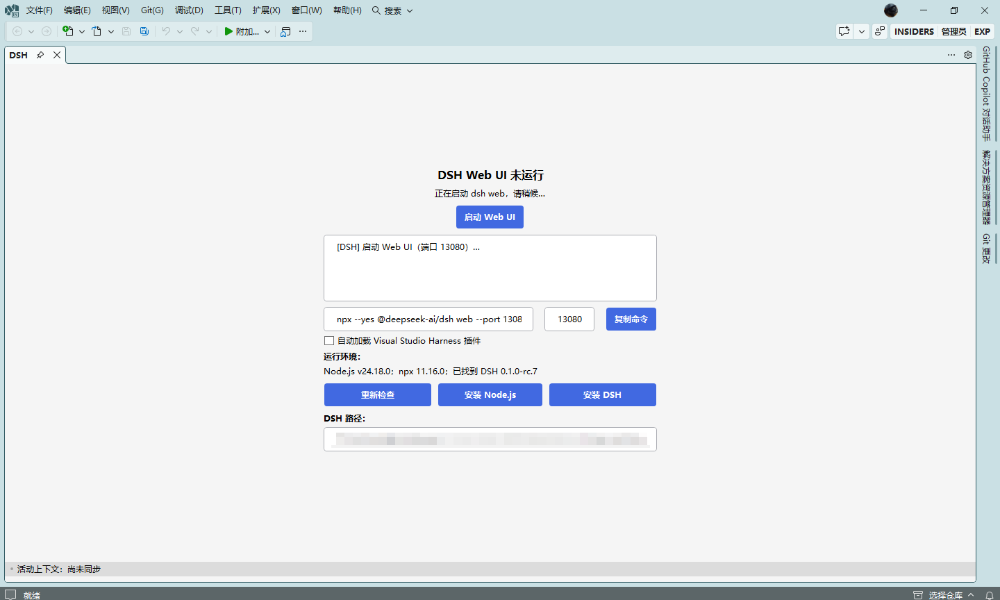
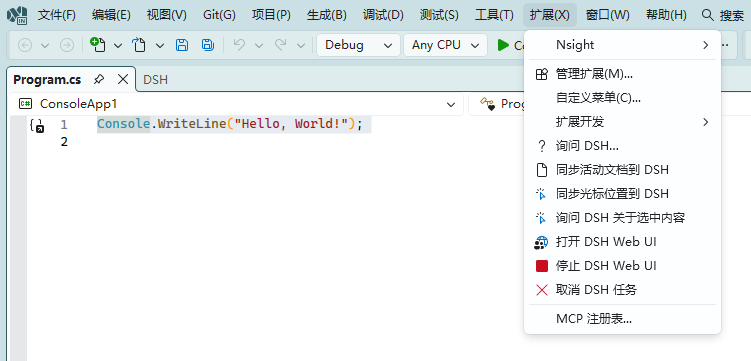
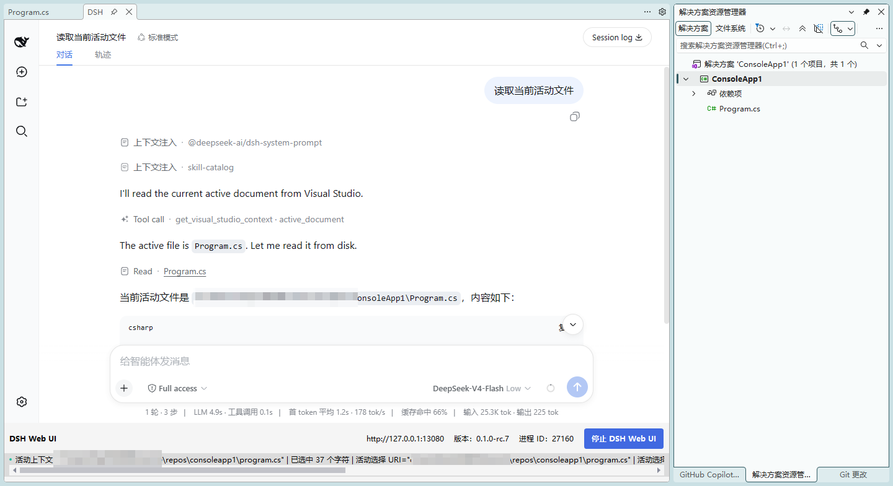

# DSH4VS

面向 Visual Studio 的 DSH 扩展，提供 DSH Web UI、编辑器上下文同步和 Visual Studio 上下文工具。

## Visual Studio 上下文插件

扩展会将本地插件 `dsh4vs-visual-studio-context` 复制到 DSH Web profile 的插件目录，由 DSH 自动加载并注册工具：

- `get_visual_studio_context`：读取最近一次从 Visual Studio 同步的上下文。
- `mode: active_document`：返回解决方案、项目、当前文件路径和文件内容。
- `mode: cursor_position`：返回当前文件路径、光标位置、当前行文本和选区文本。

使用上下文工具前，请先在 Visual Studio 中执行上下文同步命令。桥接服务地址默认为：

`http://127.0.0.1:13091/api/visual-studio/context`

## 验证状态

已验证：启用自定义插件后，`get_visual_studio_context` 可以成功获取当前活动文档及其内容。

## 使用截图

### 初始化插件

### 同步活动文档

### 使用活动文档上下文

