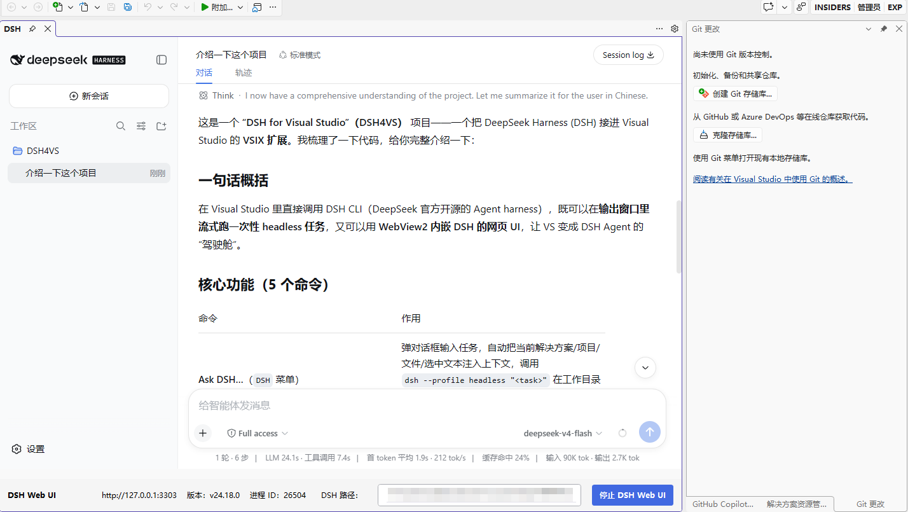

# DSH for Visual Studio

把 [DeepSeek Harness (DSH)](https://github.com/deepseek-ai/deepseek-harness) 接进 Visual Studio 的 VSIX 扩展：

- **Ask DSH…**（顶部菜单 `DSH` / 编辑器右键 *Ask DSH about selection*）
  打开对话框输入任务，把当前解决方案/项目/文件/选中文本注入上下文，然后调用
  `dsh --profile headless "<task>"` 在工作目录里独立执行一个 Agent 任务，
  输出**流式**打到 VS 的 **输出窗口（DSH 面板）**，结束后状态栏显示退出码。
- **Open DSH Web UI**：停靠式工具窗口，用 WebView2 内嵌 DSH 网页 UI（`http://127.0.0.1:3080`）。
  若 3080 没有服务会自动 `dsh web --port 3080` 启动一个（独立进程，关掉 VS 也继续跑）。
- **Cancel DSH Task**：取消正在运行的任务（taskkill 整个进程树）。

## 原理

DSH 官方提供两个可编程入口，本扩展只做"包装"：

| 入口 | 用途 | 本扩展用法 |
|---|---|---|
| `dsh --profile headless "<task>"` | 一次性任务：跑完把最后一条 assistant 消息打到 stdout 后退出（0=成功） | Ask DSH… 的核心 |
| `dsh web`（= `--profile web`） | 本地 Web 服务（127.0.0.1:3080，无认证，仅供本机） | 工具窗口内嵌 |

工作目录 = 解决方案目录 → 项目目录 → 文件目录，DSH 的 fs/工具以此为准。

## 预览



## 前置条件

1. **Visual Studio 2022 17.x+**，已安装 **“Visual Studio 扩展开发”** 工作负载
   （用于 F5 调试和 VSIX 打包）。
2. **DSH CLI**（本扩展会自动定位，无需配置）：
   - `npm install -g @deepseek-ai/dsh`，或
   - 任何能用 `npx @deepseek-ai/dsh` 的环境（扩展会在 npx 缓存里找 `bin.js`）。
   - 兜底：设置环境变量 `DSH_CLI` 指向可执行文件（如 `dsh.cmd` 的完整路径）。
3. **首次运行 headless**：`dsh --profile headless "hi"` 会自动初始化
   `%DSH_HOME%\profiles\headless`（默认 `C:\Users\<你>\.dsh`），首次稍慢属正常。
4. WebView2 Runtime（Win10/11 自带；旧系统去 [Microsoft Edge WebView2](https://developer.microsoft.com/microsoft-edge/webview2/) 安装）。

## 构建与调试

1. 用 Visual Studio 打开 `DSH4VS.sln`。
2. 首次会还原 NuGet 包（`Microsoft.VisualStudio.SDK` / `Microsoft.VSSDK.BuildTools` /
   `Microsoft.Web.WebView2`），需联网。
3. 按 **F5** → 启动**实验实例**（devenv /rootsuffix Exp），扩展自动注册：
   - 菜单栏出现 **DSH** 菜单；
   - 代码编辑器右键出现 *Ask DSH about selection*；
   - 输出窗口出现 **DSH** 面板。
4. 也可以 `dotnet build src/DSH4VS/DSH4VS.csproj -c Release` 后，用生成的
   `bin\Release\DSH4VS.vsix` 双击安装（扩展 → 管理扩展 → 从 VSIX 安装）。

## 使用示例

1. 打开一个 .cs 文件，选中一段代码。
2. 右键 → *Ask DSH about selection*，输入例如：
   `检查这段代码的竞态条件，并给出修改建议`。
3. 确定后，DSH 面板开始流式输出；任务结束状态栏显示 `DSH: 完成` / `DSH: 失败 (exit N)`。

## 常见问题

- **提示“未找到 dsh CLI”**：确认 `dsh --version` 在命令行可用；或设置 `DSH_CLI` 环境变量后重启 VS。
- **首次任务特别慢**：headless profile 首次初始化（`%DSH_HOME%\profiles\headless`），之后会快。
- **工具窗口一片空白**：确认 3080 端口有 DSH 服务；若 WebView2 初始化失败会显示错误提示。
- **想换端口**：改 `Core/DshRunner.cs` 的 `WebUrl`/`WebPort` 常量。

## 目录结构

```
DSH4VS/
├─ DSH4VS.sln
└─ src/DSH4VS/
   ├─ DSH4VS.csproj / source.extension.vsixmanifest / VSCommandTable.vsct / VSPackage.resx
   ├─ DSH4VSPackage.cs / PackageGuids.cs / PkgCmdID.cs
   ├─ Commands/DSHCommands.cs          # 菜单/右键命令注册
   ├─ Core/
   │  ├─ DshLocator.cs                 # 定位 dsh CLI（node + bin.js / dsh.cmd / DSH_CLI）
   │  ├─ DshRunner.cs                  # headless 进程管理 + web 服务启停 + 取消
   │  ├─ DSHAskContext.cs              # 采集 DTE 上下文（解决方案/文件/选中）
   │  └─ OutputPane.cs                 # “输出 → DSH”面板
   └─ UI/
      ├─ PromptDialog.xaml(.cs)        # 任务输入对话框
      └─ DSHWebWindow(.Control).xaml(.cs)  # WebView2 工具窗口
```
